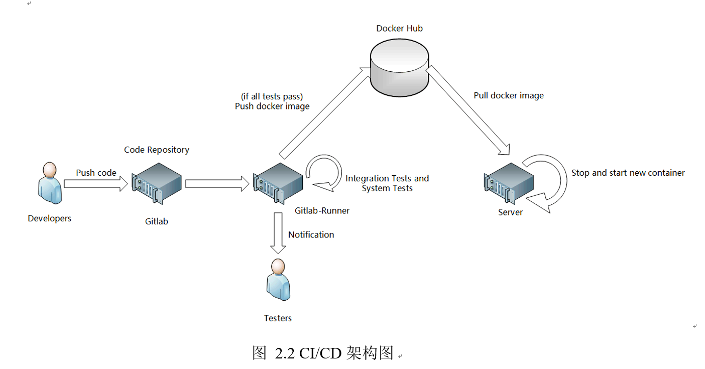

# CI/CD

## .gitlab-ci.yml
In this project, we have configured this file to guide gitlab to complete the CI task for the project. More information can be found in docs/项目测试文档.docx.

## CI platform
An [image](https://hub.docker.com/r/wangtianxia/temage-backend-test) has be built for CI test. This image contains python and MySQL.

## How to deploy?

This picture (in docs/项目测试文档.docx) has described the logical workflow of CI/CD.

## Configuration and Sample

More information can be found in docs/项目开发文档.docx and docs/项目测试文档.docx.
